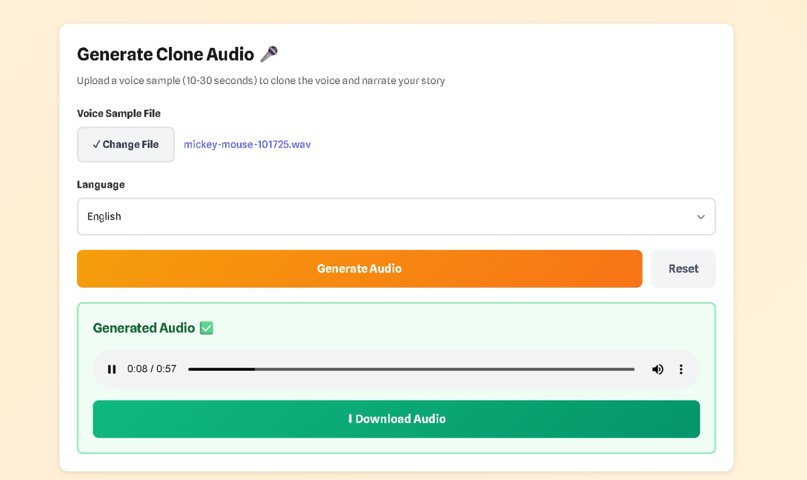
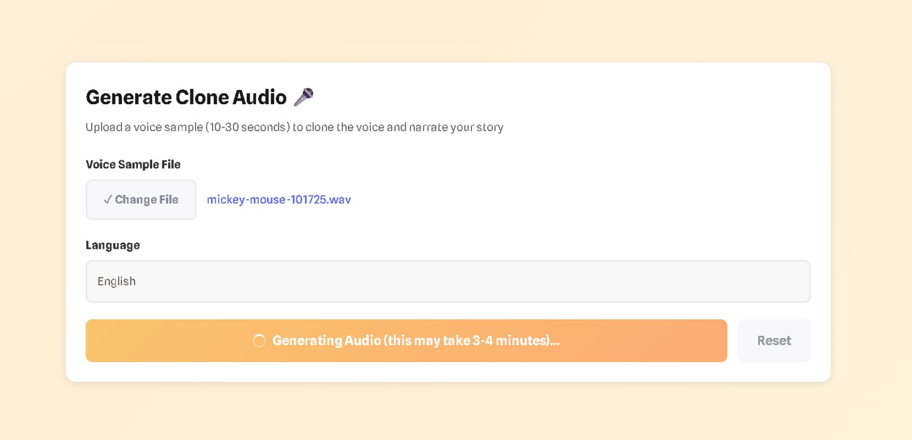
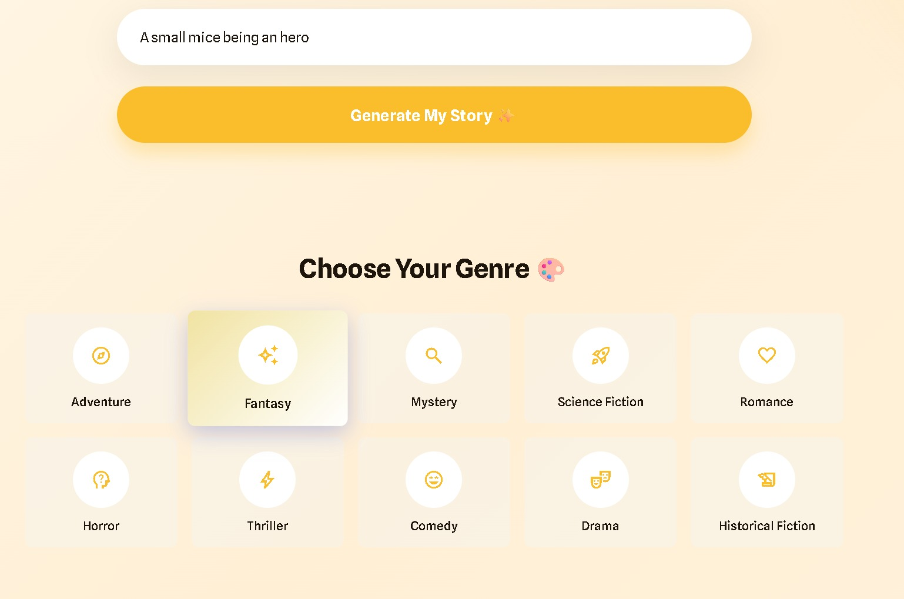
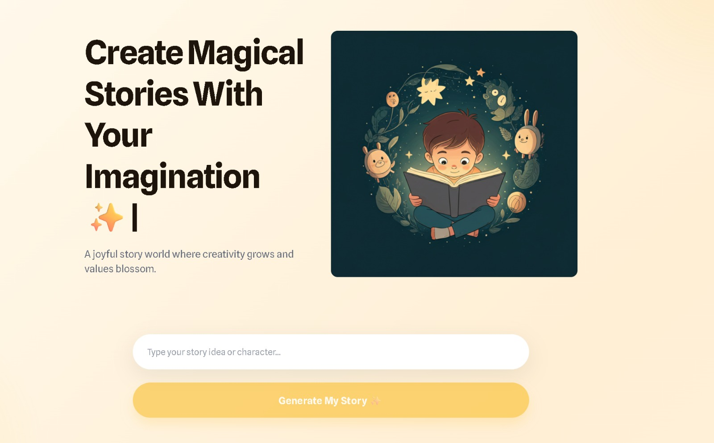

# Persona-Tales

An AI-powered story generation platform with text-to-speech capabilities. Generate personalized stories across multiple genres and listen to them with AI-narrated voice.

## Features

- 🤖 **AI Story Generation** - Powered by fine-tuned Llama 3 model for creative storytelling
- 🎭 **Multiple Genres** - Support for various story genres (Fantasy, Sci-Fi, Mystery, Mythology, etc.)
- 🎙️ **Text-to-Speech** - Convert generated stories to audio with voice cloning capabilities (CPU-optimized)
- 👤 **User Authentication** - Secure signup/login system with JWT
- 📊 **User Dashboard** - Track your story statistics and history
- 🏆 **Achievement System** - Earn badges and certificates based on your activity
- 💾 **Story Management** - Save, view, and manage your generated stories
- ☁️ **Cloud Storage** - Audio files stored on Cloudinary

## Screenshots

<div align="center">

### Landing Page



### Story Generation Interface



### User Dashboard


### Audio Playback & Voice Cloning



### Achievements & Badges



</div>

## Tech Stack

### Frontend

- React with Vite
- Redux Toolkit for state management
- React Router for navigation
- Axios for API calls
- React Hot Toast for notifications

### Backend

- Node.js with Express
- MongoDB for database
- JWT authentication
- Cloudinary integration

### AI Services (Python)

- **Story Generation**: FastAPI with Fine-tuned Llama 3 8B (GPU)
- **Text-to-Speech**: FastAPI with Coqui XTTS-v2 (CPU-only)
- PyTorch (Hybrid setup: GPU for Story, CPU for TTS)
- PEFT for model adapters

## Prerequisites

### Software

- **Node.js** v16 or higher
- **Python 3.11** (Required for TTS - NOT 3.12 or 3.10)
- **MongoDB** (local or cloud instance)
- **Git**

### Hardware

- **GPU**: CUDA-capable with 6GB+ VRAM (for Story Generation)
- **RAM**: 4-8GB free (for TTS on CPU)
- **Storage**: ~10GB free disk space

### Windows-Specific

- **Microsoft C++ Build Tools** (required for TTS installation)
  - Download: https://visualstudio.microsoft.com/visual-cpp-build-tools/
  - Select: "Desktop development with C++"

### Accounts

- **Cloudinary** account (free tier works)
- **Hugging Face** account with Llama 3 access
  - Request access: https://huggingface.co/meta-llama/Meta-Llama-3-8B-Instruct

## Installation

### 1. Clone the Repository

```bash
git clone <repository-url>
cd Persona-Tales
```

### 2. Download Pre-trained Model Adapters

Download the fine-tuned model tensors from [this Drive link](https://drive.google.com/drive/folders/11HTh5XXTWYz8b8UIVqHroasoZ13Wxode?usp=sharing).

**Extract to:**

```
server/story_tts_service/story_api_service/llama3_best_adapter/
```

**Should contain:**

- `adapter_config.json`
- `adapter_model.safetensors`
- Other checkpoint files

### 3. Setup Client (Frontend)

```bash
cd client
npm install
```

**Create `.env`:**

```env
VITE_APP_BACKEND_URL=http://localhost:4000/api/v1
```

### 4. Setup Server (Backend)

```bash
cd ../server
npm install
```

**Create `.env`:**

```env
PORT=4000
MONGODB_URL=mongodb://localhost:27017/ai-story-generator
JWT_SECRET=your_jwt_secret_key_here
CLOUD_NAME=your_cloudinary_cloud_name
API_KEY=your_cloudinary_api_key
API_SECRET=your_cloudinary_api_secret
FOLDER_NAME="YourFolderName"

# Python Services URLs
STORY_API_URL=http://localhost:8000
TTS_API_URL=http://localhost:8001
```

**Generate JWT Secret:**

```bash
node -e "console.log(require('crypto').randomBytes(32).toString('hex'))"
```

### 5. Setup Python AI Services

#### A. Story Generation Service (GPU - Port 8000)

```bash
cd server/story_tts_service

# Create virtual environment for Story API
python -m venv venv_story

# Activate
# Windows:
venv_story\Scripts\activate
# Linux/Mac:
source venv_story/bin/activate

# Install dependencies
pip install -r story_api_service/requirements.txt
```

**Create `.env` in `story_api_service/`:**

```env
HF_TOKEN="your_hugging_face_token"
```

**Get HuggingFace Token:**

1. Sign up at https://huggingface.co/
2. Request Llama 3 access (approval takes ~1 day)
3. Create token: https://huggingface.co/settings/tokens

#### B. TTS Service (CPU - Port 8001)

**⚠️ Important: Requires Python 3.11 specifically**

```bash
cd server/story_tts_service/tts_cpu_service

# Verify Python 3.11
python --version  # Should show 3.11.x
# If not, install Python 3.11 first

# Create venv with Python 3.11
py -3.11 -m venv venv
# OR: python3.11 -m venv venv

# Activate
# Windows PowerShell:
venv\Scripts\Activate.ps1
# Windows CMD:
venv\Scripts\activate.bat
# Linux/Mac:
source venv/bin/activate

# Install dependencies (takes 5-10 min first time)
pip install -r requirements.txt
```

**Windows Users:** If you see "Microsoft Visual C++ 14.0 required" error, install Build Tools first:
https://visualstudio.microsoft.com/visual-cpp-build-tools/

**Detailed TTS Setup:** See `server/story_tts_service/tts_cpu_service/README.md`

## Running the Application

You need **4 terminals running simultaneously**.

### Terminal 1: Frontend (Port 5173)

```bash
cd client
npm run dev
```

Opens at: `http://localhost:5173`

### Terminal 2: Backend (Port 4000)

```bash
cd server
npm run dev
```

Runs on: `http://localhost:4000`

### Terminal 3: Story Generation API (Port 8000)

```bash
cd server/story_tts_service

# Activate story venv
# Windows:
venv_story\Scripts\activate
# Linux/Mac:
source venv_story/bin/activate

cd story_api_service
python model_api.py
```

Runs on: `http://localhost:8000`

**First run:** Downloads Llama 3 model (~10-15GB), takes 10-20 minutes

### Terminal 4: TTS Service (Port 8001)

```bash
cd server/story_tts_service/tts_cpu_service

# Activate TTS venv (Python 3.11)
# Windows:
venv\Scripts\Activate.ps1
# Linux/Mac:
source venv/bin/activate

python tts_server.py
```

Runs on: `http://localhost:8001`

**First run:** Downloads XTTS model (~2GB), takes 2-5 minutes

## Usage

1. Open browser: `http://localhost:5173`
2. Sign up for a new account or log in
3. Enter a story prompt with your desired genre
4. Click generate to create your story
5. Listen to the AI-narrated version
6. Save your favorite stories
7. Track progress and earn achievements

## Architecture

```
┌────────────────────────────────────────────────────┐
│                 Persona-Tales                      │
├────────────────────────────────────────────────────┤
│                                                    │
│  Frontend (5173)  →  Backend (4000)               │
│  React + Vite         Node.js + Express           │
│                       ↓              ↓            │
│                   MongoDB    Python Services      │
│                                ↓           ↓      │
│                         Story API    TTS API      │
│                         (Port 8000)  (Port 8001)  │
│                         GPU: 6-8GB   CPU-only     │
│                         Llama 3      Coqui XTTS   │
│                                                    │
└────────────────────────────────────────────────────┘
```

## Project Structure

```
Persona-Tales/
├── 📄 README.md                        # Main project documentation
├── 📄 SETUP_CHECKLIST.md               # Step-by-step setup verification
│
├── 📂 docs/                            # Documentation & Assets
│   ├── screenshots/                    # Application screenshots
│   │   ├── img1.jpeg                  # Landing page
│   │   ├── img2.jpeg                  # Story generation interface
│   │   ├── img3.jpeg                  # User dashboard
│   │   ├── img4.jpeg                  # Audio playback & voice cloning
│   │   └── img5.jpeg                  # Achievements & badges
│   └── PROJECT_STRUCTURE.md           # Detailed project navigation guide
│
├── 📂 experiments/                     # Model Selection Experiments
│   ├── DistilGPT_2.ipynb              # DistilGPT-2 fine-tuning experiment
│   ├── Meta_Llama.ipynb               # Llama 3 8B fine-tuning experiment
│   └── README.md                      # Comparative analysis & methodology
│
├── 📂 client/                          # React Frontend (Port 5173)
│   ├── public/
│   │   ├── demo-audio/                # Demo story audio files
│   │   │   ├── story1.mp3
│   │   │   ├── story2.mp3
│   │   │   └── story3.mp3
│   │   └── vite.svg
│   │
│   ├── src/
│   │   ├── assets/
│   │   │   └── badges/                # Achievement badge SVGs
│   │   │       ├── beginner.svg
│   │   │       ├── enthusiast.svg
│   │   │       └── master.svg
│   │   │
│   │   ├── components/
│   │   │   ├── common/                # Shared components
│   │   │   │   ├── Navbar.jsx
│   │   │   │   ├── OpenRoute.jsx
│   │   │   │   └── PrivateRoute.jsx
│   │   │   │
│   │   │   ├── core/                  # Core UI components
│   │   │   │   └── ProfileDropdown.jsx
│   │   │   │
│   │   │   ├── landing/               # Landing page components
│   │   │   │   ├── LandingNavbar.jsx
│   │   │   │   ├── HeroSection.jsx
│   │   │   │   ├── GenreHighlights.jsx
│   │   │   │   ├── HowItWorks.jsx
│   │   │   │   ├── WhatMakesUsSpecial.jsx
│   │   │   │   ├── Footer.jsx
│   │   │   │   ├── PromptInputSection.jsx
│   │   │   │   └── landing.css
│   │   │   │
│   │   │   ├── Dashboard.jsx          # Main dashboard component
│   │   │   ├── AudioCloneSection.jsx  # Voice cloning interface
│   │   │   ├── GeneratedStoryDisplay.jsx
│   │   │   ├── ProfileCard.jsx
│   │   │   ├── StoryStatistics.jsx
│   │   │   ├── RecentStories.jsx
│   │   │   ├── Certificates.jsx       # Achievement certificates
│   │   │   ├── Certificates.css
│   │   │   ├── Header.jsx
│   │   │   └── MotivationalBanner.jsx
│   │   │
│   │   ├── pages/
│   │   │   ├── LandingPage.jsx        # Public landing page
│   │   │   ├── Home.jsx               # Authenticated home
│   │   │   ├── DemoPage.jsx           # Demo functionality
│   │   │   ├── Login.jsx
│   │   │   ├── Signup.jsx
│   │   │   └── ErrorPage.jsx
│   │   │
│   │   ├── services/
│   │   │   ├── apiConnector.js        # Axios configuration
│   │   │   └── operations/
│   │   │       ├── authAPI.js         # Authentication APIs
│   │   │       └── storyAPI.js        # Story generation APIs
│   │   │
│   │   ├── slices/                    # Redux state slices
│   │   │   ├── authSlice.js
│   │   │   └── profileSlice.js
│   │   │
│   │   ├── hooks/
│   │   │   └── useOnClickOutside.js
│   │   │
│   │   ├── data/
│   │   │   └── demoData.js            # Demo story data
│   │   │
│   │   ├── utils/
│   │   │   └── constants.js
│   │   │
│   │   ├── reducer/
│   │   │   └── index.js               # Root reducer
│   │   │
│   │   ├── App.jsx                    # Main app component
│   │   ├── main.jsx                   # Entry point
│   │   └── index.css                  # Global styles
│   │
│   ├── .env                           # Frontend environment variables
│   ├── ENV_TEMPLATE.txt               # Environment template
│   ├── package.json
│   ├── vite.config.js                 # Vite configuration
│   ├── eslint.config.js
│   └── index.html
│
└── 📂 server/                          # Express Backend (Port 4000)
    ├── config/
    │   ├── database.js                # MongoDB connection
    │   └── cloudinary.js              # Cloudinary configuration
    │
    ├── controllers/
    │   ├── Auth.js                    # Authentication logic
    │   └── Story.js                   # Story CRUD operations
    │
    ├── models/
    │   ├── User.js                    # User schema
    │   └── Story.js                   # Story schema
    │
    ├── routes/
    │   ├── User.js                    # User routes
    │   └── Story.js                   # Story routes
    │
    ├── middlewares/
    │   └── auth.js                    # JWT verification
    │
    ├── utils/
    │   └── fileUploader.js            # Cloudinary upload helper
    │
    ├── story_tts_service/             # Python AI Services
    │   │
    │   ├── story_api_service/         # Story Generation API (Port 8000)
    │   │   ├── llama3_best_adapter/   # Fine-tuned LoRA adapters
    │   │   │   ├── adapter_config.json
    │   │   │   ├── adapter_model.safetensors
    │   │   │   ├── checkpoint-203/    # Training checkpoints
    │   │   │   ├── checkpoint-406/
    │   │   │   ├── checkpoint-609/
    │   │   │   ├── checkpoint-812/
    │   │   │   ├── checkpoint-1015/   # Best checkpoint
    │   │   │   └── runs/              # TensorBoard logs
    │   │   │
    │   │   ├── venv/                  # Python virtual environment
    │   │   ├── model_api.py           # FastAPI server
    │   │   ├── .env                   # HuggingFace token
    │   │   └── ENV_TEMPLATE.txt
    │   │
    │   ├── tts_cpu_service/           # Text-to-Speech API (Port 8001)
    │   │   ├── venv/                  # Python 3.11 virtual environment
    │   │   ├── tts_server.py          # FastAPI TTS server
    │   │   ├── requirements.txt       # TTS dependencies
    │   │   ├── sample_voice.wav       # Sample voice file
    │   │   ├── Recording.wav          # User recordings
    │   │   ├── result.wav             # Generated audio output
    │   │   ├── README.md              # TTS setup guide
    │   │   └── NODEJS_INTEGRATION.md  # Node.js integration docs
    │   │
    │   └── requirements.txt           # Shared Python dependencies
    │
    ├── .env                           # Backend environment variables
    ├── ENV_TEMPLATE.txt               # Environment template
    ├── package.json
    ├── index.js                       # Express server entry point
    └── README.md                      # Server documentation
```

### Key Directories Explained

**📂 docs/** - Contains all project documentation and visual assets

**📂 experiments/** - Jupyter notebooks documenting the model selection process (DistilGPT-2 vs Llama 3)

**📂 client/** - React-based frontend with Redux state management, serving the user interface

**📂 server/** - Node.js backend handling authentication, database operations, and orchestrating AI services

**📂 story_api_service/** - Python FastAPI service running fine-tuned Llama 3 8B on GPU for story generation

**📂 tts_cpu_service/** - Python FastAPI service running Coqui XTTS-v2 on CPU for text-to-speech with voice cloning

**📂 llama3_best_adapter/** - QLoRA adapters containing the fine-tuned weights for our story generation model

## Environment Variables

### Client `.env`

```env
VITE_APP_BACKEND_URL=http://localhost:4000/api/v1
```

### Server `.env`

```env
PORT=4000
MONGODB_URL=mongodb://localhost:27017/ai-story-generator
JWT_SECRET=<generate-random-string>
CLOUD_NAME=<cloudinary-cloud-name>
API_KEY=<cloudinary-api-key>
API_SECRET=<cloudinary-api-secret>
FOLDER_NAME="YourFolderName"
STORY_API_URL=http://localhost:8000
TTS_API_URL=http://localhost:8001
```

### Story API `.env`

```env
HF_TOKEN="your_hugging_face_token"
```

### TTS Service

No `.env` needed - configured in code

## Troubleshooting

### MongoDB Connection Error

- Ensure MongoDB is running: `mongod` or `net start MongoDB`
- Check connection string in `server/.env`
- Verify port 27017 is not blocked

### GPU Memory Issues (Story API)

- Close other GPU applications
- Check VRAM usage: `nvidia-smi`
- Ensure TTS is using CPU (not GPU)
- Model uses 4-bit quantization (~6-8GB VRAM)

### Python Version Issues (TTS)

- **Critical:** TTS requires Python 3.11 (NOT 3.12)
- Check: `python --version` or `py --list`
- Install 3.11: https://www.python.org/downloads/release/python-31110/
- Use: `py -3.11 -m venv venv`

### Microsoft Visual C++ Error (Windows, TTS)

- Install C++ Build Tools
- Download: https://visualstudio.microsoft.com/visual-cpp-build-tools/
- Select: "Desktop development with C++"
- Restart computer, then reinstall: `pip install -r requirements.txt`

### Port Conflicts

```bash
# Check which ports are in use
netstat -ano | findstr "4000 5173 8000 8001"

# Kill process if needed
taskkill /PID <pid> /F
```

### Hugging Face Token Error

- Ensure you requested Llama 3 access (takes ~1 day for approval)
- Verify token has read permissions
- Check token: https://huggingface.co/settings/tokens

### TTS Model Not Loading

- Wait longer on first run (~2-5 min download)
- Check internet connection
- Verify 2GB+ free disk space
- Check logs for download progress

## Testing

### Quick Test All Services

**Frontend:**

```bash
http://localhost:5173
```

Should load the React app

**Backend:**

```bash
curl http://localhost:4000/api/v1/health
```

**Story API:**

```bash
curl -X POST http://localhost:8000/generate \
  -H "Content-Type: application/json" \
  -d '{"prompt":"test"}'
```

**TTS API:**

```bash
curl.exe http://localhost:8001/health
```

## Development

### Starting Fresh

1. Pull latest code: `git pull`
2. Update dependencies:
   - Frontend: `cd client && npm install`
   - Backend: `cd server && npm install`
   - Python services: `pip install -r requirements.txt`

### Monitoring Resources

- **GPU (Story):** `nvidia-smi` - Should use 6-8GB
- **CPU (TTS):** Task Manager - Should use 80-100% during generation
- **Ports:** All 4 services must run simultaneously

## Documentation

- **Complete Setup Checklist:** `SETUP_CHECKLIST.md`
- **Model Selection Experiments:** `experiments/README.md`
- **Environment Templates:**
  - `client/ENV_TEMPLATE.txt`
  - `server/ENV_TEMPLATE.txt`
  - `server/story_tts_service/story_api_service/ENV_TEMPLATE.txt`

---

## Research & Technical Foundation

This project is built upon cutting-edge research in language models, quantization, and speech synthesis.

### Core Research Papers

#### 1. QLoRA: Efficient Finetuning of Quantized LLMs

**Citation:** Dettmers, T., et al. (2023). _QLoRA: Efficient Finetuning of Quantized LLMs_. [arXiv:2305.14314](https://arxiv.org/abs/2305.14314)

**Use in Project:**

- Enabled fine-tuning Llama 3 8B on consumer GPU (RTX 4060 10GB)
- 4-bit quantization reduced VRAM usage from ~16GB to ~6GB
- Maintained model quality while making large language models accessible
- Core technique for our Story Generation API

**Impact:** Without QLoRA, we would need expensive cloud GPUs or be limited to much smaller models with inferior storytelling capabilities.

#### 2. Better Speech Synthesis through Scaling (Tortoise TTS)

**Citation:** Betker, J. (2023). _Better Speech Synthesis through Scaling_. [arXiv:2305.07243](https://arxiv.org/abs/2305.07243)

**Use in Project:**

- Foundational architecture for Coqui XTTS-v2 (our TTS engine)
- Autoregressive transformer treats audio generation like text generation
- Enables zero-shot voice cloning from short audio samples
- Powers our Text-to-Speech API with voice personalization

**Impact:** This architecture breakthrough allows users to clone voices using just 6-10 seconds of audio, making personalized narration accessible to everyone.

#### 3. TinyStories: How Small Can Language Models Be?

**Citation:** Eldan, R., & Li, Y. (2023). _TinyStories: How Small Can Language Models Be and Still Speak Coherent English?_ [arXiv:2305.07759](https://arxiv.org/abs/2305.07759)

**Use in Project:**

- Validated our dataset curation strategy
- Proved domain-specific fine-tuning works with smaller, high-quality datasets
- Inspired our approach: fine-tune powerful model on 100 curated children's stories
- Demonstrated that constrained vocabulary enhances coherence for target audience

**Impact:** This research justified using a curated dataset of 100 stories instead of massive web-scraped data, resulting in better quality and faster training.

### Additional References

- **PEFT (Parameter-Efficient Fine-Tuning):** [Hugging Face PEFT Library](https://github.com/huggingface/peft)
- **Llama 3 Model:** [Meta-Llama-3-8B-Instruct](https://huggingface.co/meta-llama/Meta-Llama-3-8B-Instruct)
- **Coqui TTS:** [XTTS-v2 Documentation](https://docs.coqui.ai/)

---

## Dataset

### Training Data

Our story generation model was fine-tuned on a custom-curated dataset of 100 high-quality children's stories.

**📊 Dataset Link:** [View Dataset on Google Sheets](https://docs.google.com/spreadsheets/d/1fG7maZYAvMdhCTcasCjEYDaH6UMz8NrB0MaCbRq37dQ/edit?usp=sharing)

**Dataset Composition:**

- **Total Stories:** 1000
- **Genres:** Adventure & Exploration, Fantasy, Mystery, Mythology, Sci-Fi
- **Format:** Structured with Prompt, Characters, Genre, and Story fields
- **Average Length:** 150-300 words per story
- **Target Audience:** Children (ages 6-12)

**Data Split:**

- Training: 81 stories (81%)
- Validation: 9 stories (9%)
- Test: 10 stories (10%)

**Curation Principles:**

- Age-appropriate content and vocabulary
- Diverse character representations
- Clear narrative structure (beginning, middle, end)
- Positive themes and educational value
- Grammatically correct and well-written

**Quality Control:**

- Manual review of all stories
- Consistency in formatting
- Balanced genre distribution
- Culturally sensitive content

This carefully curated approach, inspired by the [TinyStories paper](https://arxiv.org/abs/2305.07759), proved more effective than using large, noisy web-scraped datasets.

---

## Model Selection & Experiments

We conducted rigorous experiments to select the optimal model architecture for story generation. The complete analysis is available in the `experiments/` folder.

### Compared Models

1. **DistilGPT-2** (82M parameters)

   - ✅ Fast inference, low memory
   - ❌ Poor coherence, repetitive output

2. **Meta Llama 3 8B Instruct** (8B parameters)
   - ✅ Excellent storytelling quality
   - ✅ Strong genre adherence
   - ✅ Creative and coherent narratives
   - ⚠️ Higher computational requirements

**Winner:** Meta Llama 3 8B Instruct

**Rationale:** The dramatic improvement in story quality justified the additional computational requirements. With QLoRA optimization, we made it feasible on consumer hardware.

**📖 Detailed Analysis:** See `experiments/README.md` for comprehensive comparison, metrics, and methodology.

---

## Future Scope & Enhancements

### Short-Term Goals (Next 3-6 months)

1. **Model Optimization**

   - Implement speculative decoding for 2-3x faster inference
   - Explore smaller Llama variants (1B-3B) for reduced latency
   - Test quantization to 3-bit or 2-bit for even lower VRAM usage

2. **Feature Enhancements**

   - Multi-language story generation (Hindi, Spanish, French)
   - Illustration generation using Stable Diffusion
   - Interactive storytelling with user choices
   - Story continuation and character memory

3. **User Experience**
   - Mobile app (React Native)
   - Offline mode with cached stories
   - Social features (share stories, like, comment)
   - Parental controls and content filtering

### Medium-Term Goals (6-12 months)

4. **Model Distillation**

   - Distill fine-tuned Llama 3 into 1B parameter SLM (Small Language Model)
   - Target: Run entirely on smartphone CPU without server
   - Maintain 80%+ quality with 10x faster inference

5. **Advanced TTS**

   - Implement non-autoregressive TTS for faster generation
   - Multi-speaker support within single story
   - Emotional speech synthesis (happy, sad, excited voices)
   - Background music and sound effects integration

6. **Educational Features**
   - Reading comprehension quizzes
   - Vocabulary building exercises
   - Story-based learning modules
   - Teacher dashboard for classroom use

### Long-Term Vision (1-2 years)

7. **Multimodal Storytelling**

   - Video generation from stories
   - Animated character creation
   - VR/AR story experiences
   - Interactive story games

8. **AI Personalization**

   - Learning from user preferences
   - Adaptive difficulty levels
   - Personalized story recommendations
   - Character consistency across stories

9. **Platform Expansion**
   - API for third-party integrations
   - White-label solution for schools
   - Publisher partnerships
   - Content creator marketplace

### Research Directions

10. **Novel Architectures**

    - Explore emerging models (Phi-3, Gemma-2, Mistral)
    - Test mixture-of-experts (MoE) models
    - Investigate retrieval-augmented generation (RAG)
    - Experiment with flow matching for faster TTS

11. **Efficiency Techniques**
    - GPTQ or AWQ quantization for edge deployment
    - CPU offloading for larger models
    - Model pruning and compression
    - Hybrid cloud-edge inference

---

## Contributors

This project was developed by:

- **[Anshul Kansal](https://github.com/anshulkansal04)**
- **[Lov Kumar Kumawat](https://github.com/Lovkumawat)**
- **[Vishwas Mishra](https://github.com/CyberMage7)**
- **[Satwik Pandey](https://github.com/worldisconfusion)**

## License

(Add your license here)

---

**Need Help?**

1. Check `SETUP_CHECKLIST.md` for step-by-step verification
2. Review service-specific READMEs
3. Verify all environment variables are set
4. Check that all 4 services are running
5. Review troubleshooting sections above
